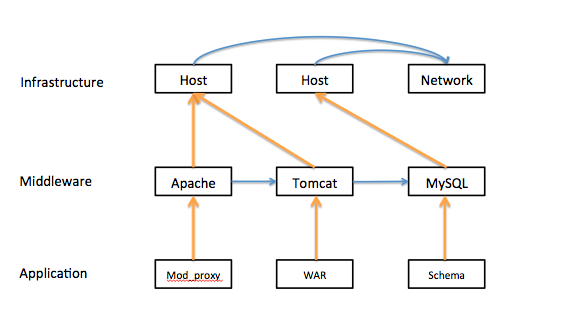
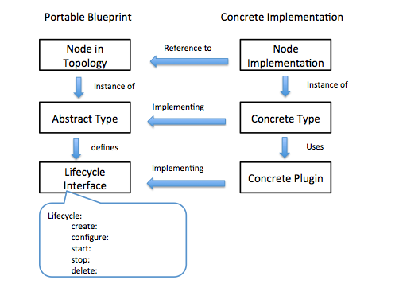
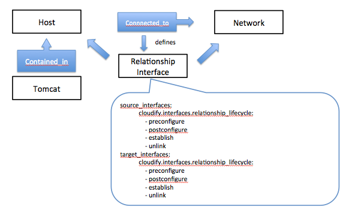
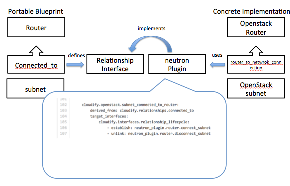

---
layout: bt_wiki
title: Understanding Blueprints
category: Understanding Blueprints
publish: false
abstract: Explains how Cloudify Blueprints are composed, theor parts and their syntax
pageord: 300
--- 

# Overview
Cloudify `Blueprints` are cloud application orchestration plans. The main part of the plan is written in a declarative YAML DSL (Doamin Specific Language). Cloudify DSL is following the concepts of [OASIS TOSCA](http://www.oasis-open.org/committees/tc_home.php?wg_abbrev=tosca) (Topology and Orchestration Standard for Cloud Application)

`Blueprints` has 2 main sections:

* **Topology** - the application topology (the `nodes` section in the `blueprint` YAML file)
* **Worflows** - the different automation process for the application (the `workflows` section in the `blueprint` YAML file )


blueprint:
    name: hello_world
    nodes:
        - name: vm_node
          type: cloudify.types.host
        # ommitted for brevity
    workflows:
        install:
            ref: "cloudify.workflows.install"
        uninstall:
            ref: "cloudify.workflows.uninstall"



# What's in a Topology?
A Topology is a graph of application components and their relationships described in YAML. You can think about it as application components being the vertices of the graph and the relationships being the edges of the graph. Each component is described by a YAML object denoted as a YAML list entry. 

Components can be of 3 levels:

* **Infrastructrue** - Components provided by the IaaS layer (e.g. VM, virtual network, virtual load balancer or storage volume) or by non-cloud phyiscal or virtualized layer (e.g. Host and storage voluem)
* **Platform / Middleware** - Components that serve as the application containers (such as webservers, application servers, message servers and database servers)
* **Application modules** - The different application artifacts that needs to be deployed and configured on top of the middleware (such as application binaries, application configuration files, database schemas etc) 

 

Cloudify (Following TOSCA) uses the following terminology for the Topology parts:

* Components are called `nodes`
* Components relationships are called `relationships`

The `blueprint` YAML document has a `nodes` section which is a YAML list.


nodes:
    - name: first_node
      type: cloudify.types.host
      # omitted for brevity
    - name: second_node
      type: clouydify.types.web_server
      # omitted for brevity



# Nodes & Types

Each `node` is an instance of a `type`. A `type` can be defined in the blueprint file, in another YAML file or imported from the product built-in types.

There are two types of `type`: portable and concerete.

A portable type that has no implementation details. For examply `cloudify.types.host` is an abstract type. It doesn't have any implementation details advising the orchestrator how to materialize an instance of it on a particular environment. A portable type will declare an `interface` a set of hooks named `operations` that can be implemented by concrete types using a `operation` mapping to `plugin` methods. For example `cloudify.openstack.server` is an `Openstack` implementation of `cloudify.types.host` using a `plugin` that uses the `Nova` compute API.

 

## Types and Type implementations

While a node in the `blueprint` YAML file is often an instance of a portable abstract type, the user need to include another YAML file with concrete instances in the `blueprint` folder. This file will be used by the Orchestrator in a particular enviornment such as `OpenStack`. The concrete instances are called `type implementation` and they contain specific properties for the specific `node` in the blueprint they implement.

So each `type implementation` block has a `type` property pointing to the concrete type it is an instance of (e.h. `cloudify.openstack.router`) and a `ref` property pointing to the `node id` it implements in the `blueprint`

## The lifecycle Interface
The `cloudify.types.base_type` declares the `lifecycle` interface which all types inherit. This interface has the most essential installation and uninstallation hooks. The cloudify built-in `install` and `uninstall` workflows use these hooksto deploy and undeploy applications.
The operations for this interface are:
* `create` - component installation
* `configure` - component configuration changes post installation
* `start` - component startup
* `stop` - component shutdown
* `delete` - component uninstallation

## Node Properties
The `node` `properties` section is a YAML `map`. It can be as nested map as you want. Node properties are defined by the `type` this node is instance of. Usually, the `node` properties will be only ones that are indifferent to the underlying cloud or to the tool used to materialize the component. For example a webserver port property is indifferent to any infrastructure or tool (while image_id is a term for specific clouds and the value differes from one cloud to another)

The `type implementation` which is specific for a particular environment or toolchain will have sepcific properties decalred by the concrete type and specific values for this particular instance.

**Cloudify enforces the first level properties declared by types as a schema**

## Node SLA
A `node` in the `blueprint` is not neccessarily one instance of the component in the `deployment`.
It can reperesent any number of runtime components. The way to do so is to specify the `instances` property.


    - name: frontend_host
        type: cloudify.types.host
        instances:
            deploy: 4


In this case Cloudify will deploy 4 instances of the frontend_host or in other words 4 virtual machines

## Relationships

Relationshipd secribes the type of dependency between 2 nodes. There are 3 types of abstract built-inrealtionships:

* `contained_in` : when one node is installed on another node. for example an apache webserver is installed on a VM. A WAR file is deployed on a Tomcat server, etc. This `relationship` ensures that the `target node` will exist before attempting to create the `source node`

* `connected_to` : when one node needs a connection to another node. For example a Tomcat server needs a JDBC connection to a mySQL database server. The relationship allows the user to configure the `source node`, the `target node` or both of them before starting these nodes. It also helps to pass runtime information to the `source node` about the `target node`

* `depends_on`   : when one node must be started or created after another node already exist, but without any connection between them

### Concrete relationship types
The above abstract rerltionship types do not provide the implementations for a specific relationship configuration
For example a connected_to can be a JDBC connection to Oracle or a connection to MongoDb or even a connection between subnet and a router on a specific cloud. There is a need for concrete repationship types that will use concrete plugins to configure specific types of relationships

### Relationship Interface
The realtionship interface is optional. In many cases you don't need to perform any special actions, you just expect the orchestrator to time right the creation and startup of components. However, in cases you do need to change configration in order to wire together two components, the relationship interface and the workflow mechnism for using it come-in handy.

The interface decalres the following operations (on source and on target separately)

* `preconfigure` - actions to perform before configuring the component
* `postconfigure` - actions to perform after configuring the component
* `establish` - actions to perform after the `target node` is ready for establishing a connection
* `unlink` - actions to perform when a relationship needs to be removed (for eample the `target node` crashed)

# Workflows

Cloudify can orchestrate any process described in a `workflow`
workflows can be explictly listed in the `workflows` section of the `blueprint`

In many cases you will not see any `workflows` section in the `blueprint`. In this case Cloudify assumes you are allowd to run the built-in workflows on the topology `nodes` listed in this `blueprint`

## What is a Workflow?
A `workflow` is an orchestration algorithm written in a lnaguage that a workflow can execute.
In the case of Cloudify it is a `radial` script. 

## Built-in Workflows
Currently Cloudify comes with 2 built-in workflows:
* install - a workflow that installs an application
* uninstall - a workflow that gracefully uninstalls an application

## Custom Workflows
In order to add a custom workflow you need to create a rdial script in the same folder of your `blueprint`
Inside the blueprint add the following block:


workflows:
    install:
        ref: "cloudify.workflows.install"
    uninstall:
        ref: "cloudify.workflows.uninstall"
    my_workflow:
        ref: my_workflow.radial



# Built-in Types and Interfaces
Cloudify comes with most of the infrastrucutre types you will need for any supported provider. In addition there are built-in middleware and application level built-in types using popular configuration management and automation tools
We constantly work to add more types so you will not need to code much in order to use Cloudify

## Portable Types
Cloudify has the following portable types:

* `cloudify.types.base` - The base type for all built-in types. declares the `lifecycle interface`
* `cloudify.types.tier` - A marker for a future scale group
* `cloudify.types.host` - A compute resource either a virtual or a physical host
* `cloudify.types.container` - A logical partition in a host such as [linux container](http://en.wikipedia.org/wiki/LXC) or [docker](https://www.docker.io/)
* `cloudify.types.network` - A virtual network
* `clouydify.types.subnet` - A virtual segment of IP addresses in a network
* `cloudify.types.router` - A virtual layer 3 router
* `cloudify.types.port` - An entry in a virtual subnet. Can be used in some clouds to secure a static private IP
* `cloudify.types.virtual_ip` - A virtual IP implemented as [NAT](http://en.wikipedia.org/wiki/Network_address_translation) or in another manner
* `cloudify.types.security_group` - A cloud security group (VM network access rules) 
* `cloudify.types.load_balancer` - A virtualized Load Balancer 
* `cloudify.types.volume` - A persistent block storage volume
* `cloudify.types.object_container` - A BLOB storage segment
* `cloudify.types.middleware_server` - A base type for all middleware level types
* `cloudify.types.web_server` - A web server
* `cloudify.types.app_server` - An application server
* `cloudify.types.db_server` - a Database
* `cloudify.types.message_bus_server` - a message bus server
* `cloudify.types.app_module` - a base type for any application module or artifact

### OpenStack Built-in Types
Cloudfiy has the following concrete OpenStack types:

* `cloudify.openstack.server` - a [Nova Server](http://docs.openstack.org/api/openstack-compute/2/content/compute_servers.html)
* `cloudify.openstack.subnet` - a [Neutron Subnet](http://docs.openstack.org/api/openstack-network/2.0/content/subnets.html)
* `cloudfiy.openstack.security_group` - a [Neutron Security Group](http://docs.openstack.org/training-guides/content/module002-ch004-security-in-neutron.html)
* `cloudify.openstack.router` - a [Neutron Router](http://docs.openstack.org/api/openstack-network/2.0/content/router_ext.html)
* `cloudify.openstack.port` - a [Neutron Port](http://docs.openstack.org/api/openstack-network/2.0/content/ports.html)
* `cloudify.openstack.network` - a [Neutron Network](http://docs.openstack.org/api/openstack-network/2.0/content/networks.html)
* `cloudify.openstack.floatingip` - a [Neutron Floating IP](http://docs.openstack.org/training-guides/content/module002-ch004-floating-ips.html)

## Bash Built-In Types
Cloudify has the followin built-in types that work with the bash plugin. The [bash plugin](https://github.com/CloudifySource/cloudify-bash-plugin/archive/develop.zip) let the user specify bash scripts for the different lifecycle events

* `cloudify.types.bash.web_server` - a web server materialized using bash scripts
* `cloudify.types.bash.app_server` - an app server materalized using bash scripts
* `cloudify.types.bash.db_server` - a db server materalized using bash scripts
* `cloudify.types.bash.message_bus_server` - a message bus server materalized using bash scripts
* `cloudify.types.bash.app_module` -an app module materalized using bash scripts

All of the above declare the `scripts` property which is a map, the key being the lifecycle hhok name and the key the name of the bash script.
The scripts should be under scripts folder next to your blueprint YAML file. The CLI will pack them and upload them to the file server from where the plugin can take them.

## Interfaces

Cloudify has the following built-in interfaces:

* `cloudify.interfaces.lifecycle` - this is the basic interface declared by `cloudify.types.base`



# base type for provided cloudify types
    cloudify.types.base:
        interfaces:
            cloudify.interfaces.lifecycle:
                - create
                - configure
                - start
                - stop
                - delete



* `cloudify.interfaces.worker_installer` - this interface has the hooks for agent lifecycle. Decalred by `cloudify.types.host`:


cloudify.interfaces.worker_installer:
    - install: worker_installer.tasks.install
    - start: worker_installer.tasks.start
    - restart: worker_installer.tasks.restart


`cloudify.interfaces.relationship_lifecycle` - this interface provides the hooks for configuring a relationship between nodes (typically a connection over some protocol). Decalred by `cloudify.relationships.depends_on`
* `cloudify.interfaces.plugin_installer` - this interface manages plugin installations. Decalred by `cloudify.types.host`:


cloudify.interfaces.plugin_installer:
    - install: plugin_installer.tasks.install



* `cloudify.interfaces.host` - this interface provides a hook for reporting the state of the host to the policy engine (start detection)  . Declared by `cloudify.types.host`:


cloudify.interfaces.host:
                - get_state



* `cloudify.interfaces.relationship_lifecycle` - this interface provides the hooks for configuring a relationship between nodes (typically a connection over some protocol). Decalred by `cloudify.relationships.depends_on`


 cloudify.interfaces.relationship_lifecycle:
    - preconfigure
    - postconfigure
    - establish
    - unlink



## Relationship types

Cloudify has the following built-in concrete relationships:

* `cloudify.openstack.port_connected_to_security_group` - this relationship configures a `port` to be part of a `security group`
* `cloudify.openstack.subnet_connected_to_router` - this relationship configures a `subnet` to be registered as internal interface in a `router`

